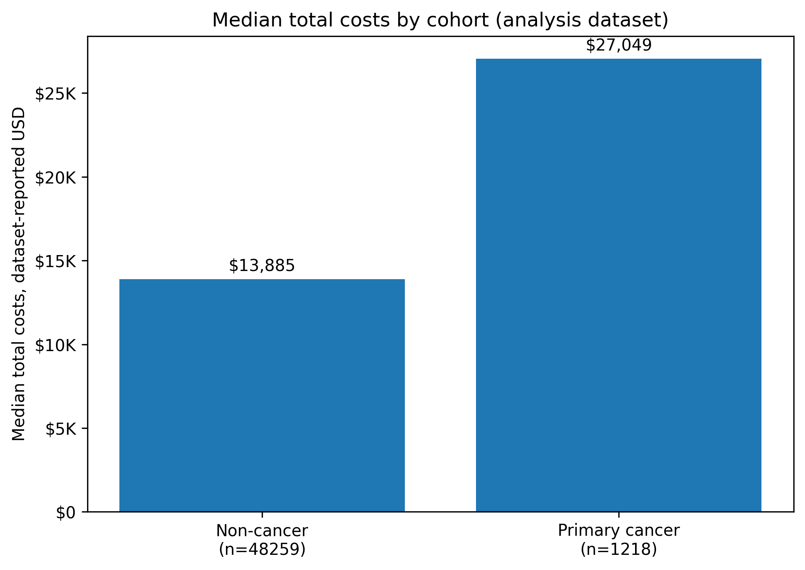
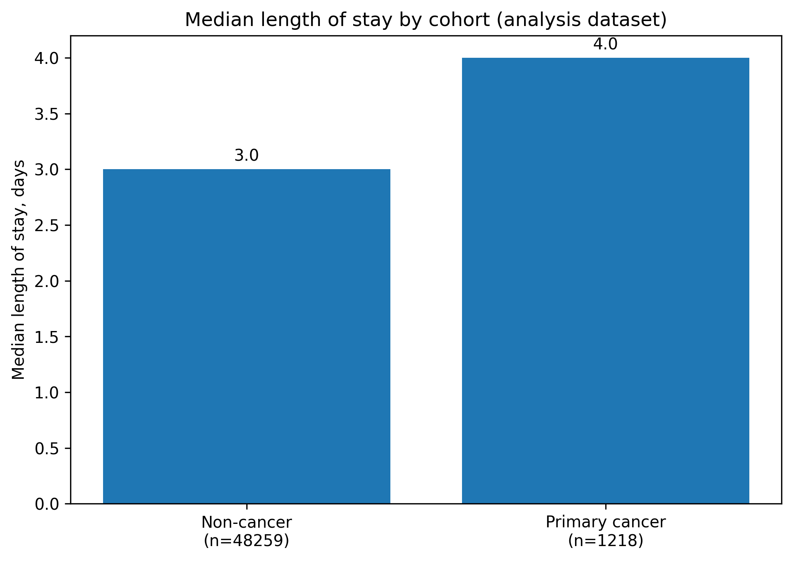
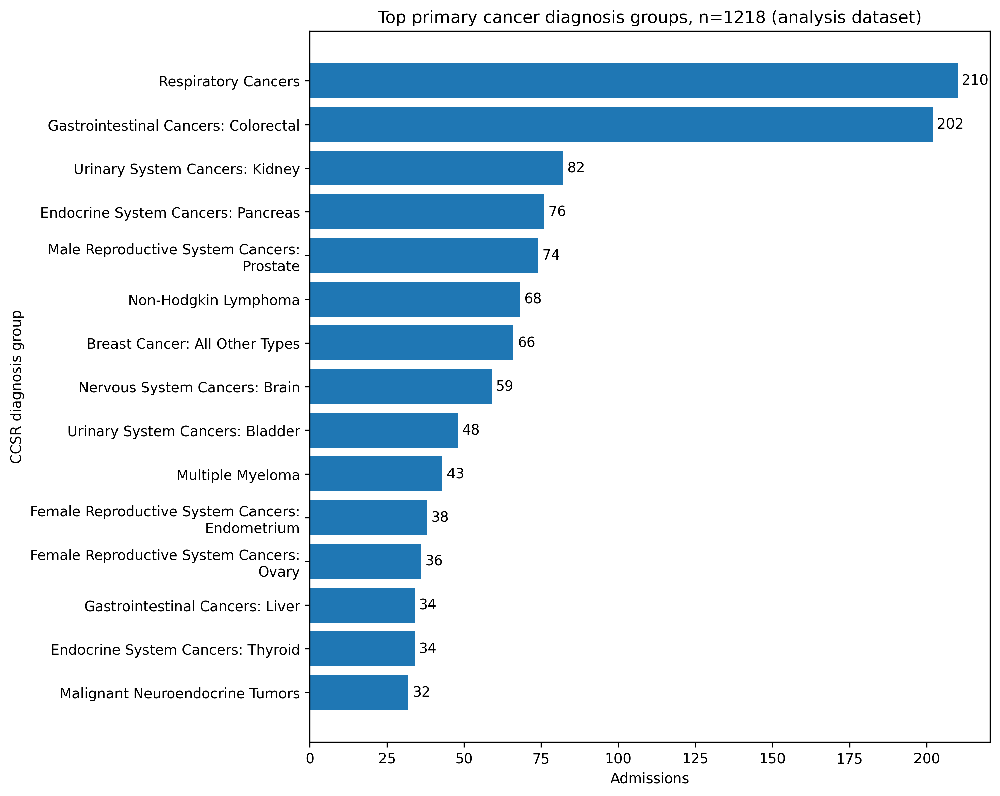
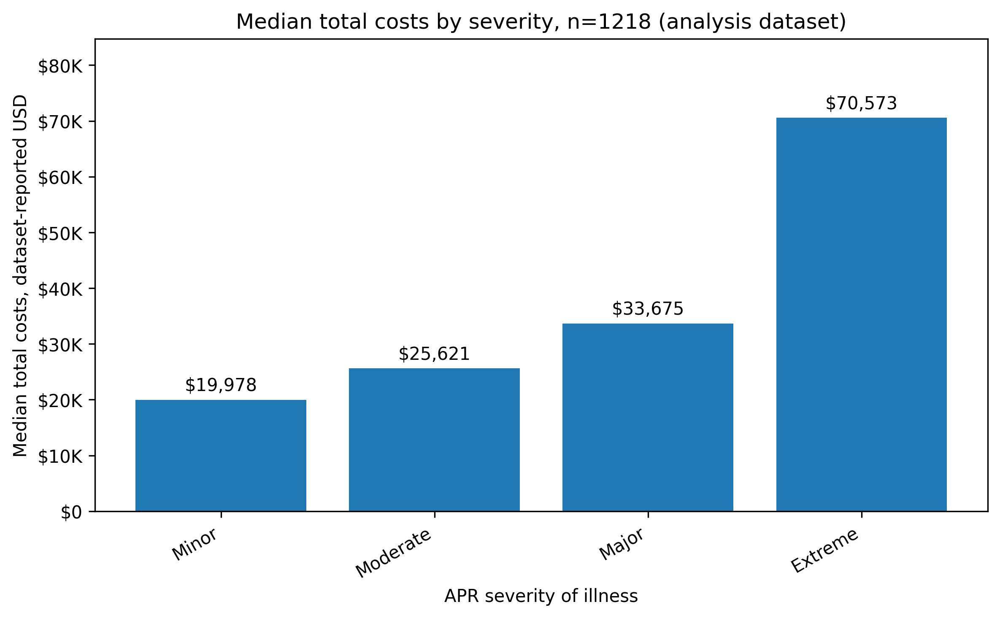
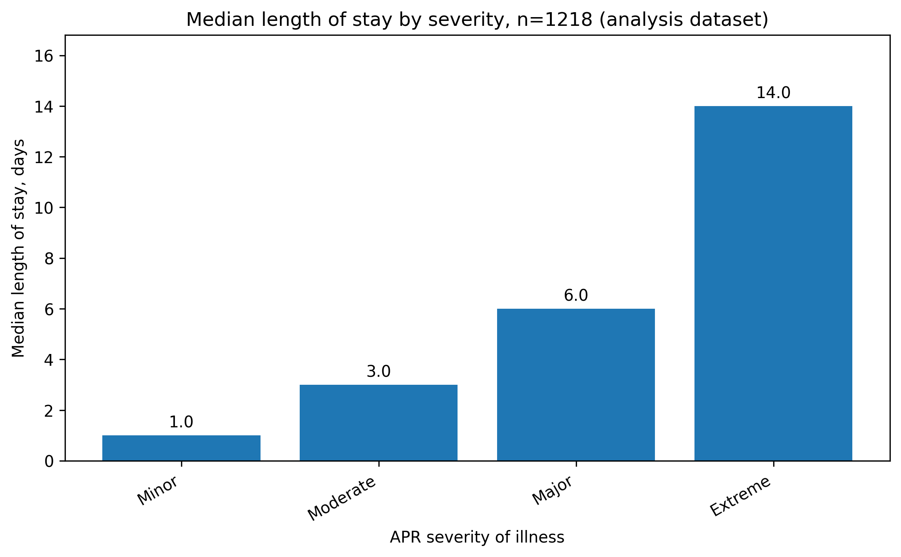
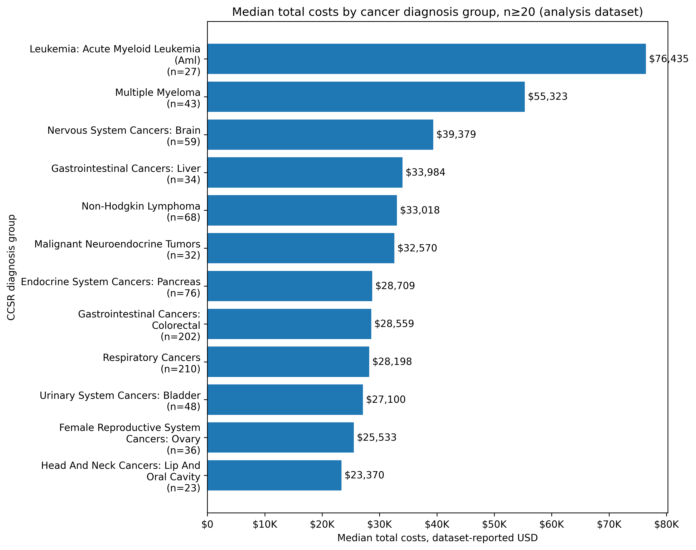
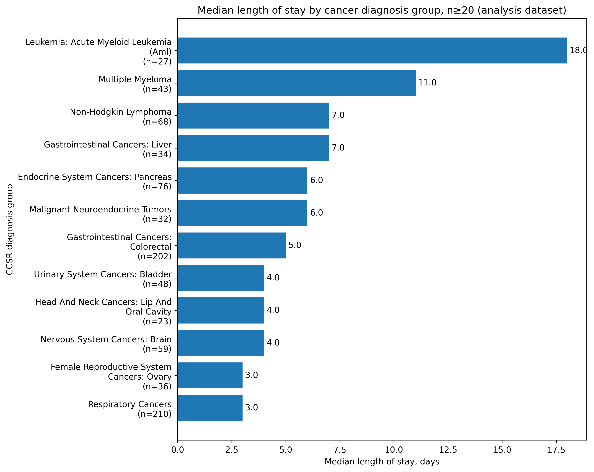
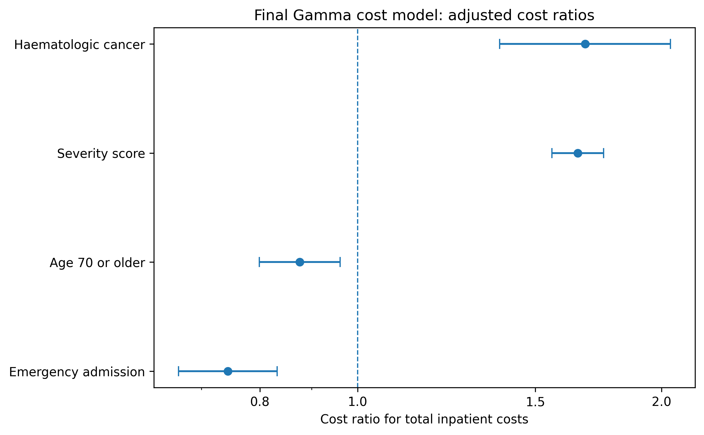
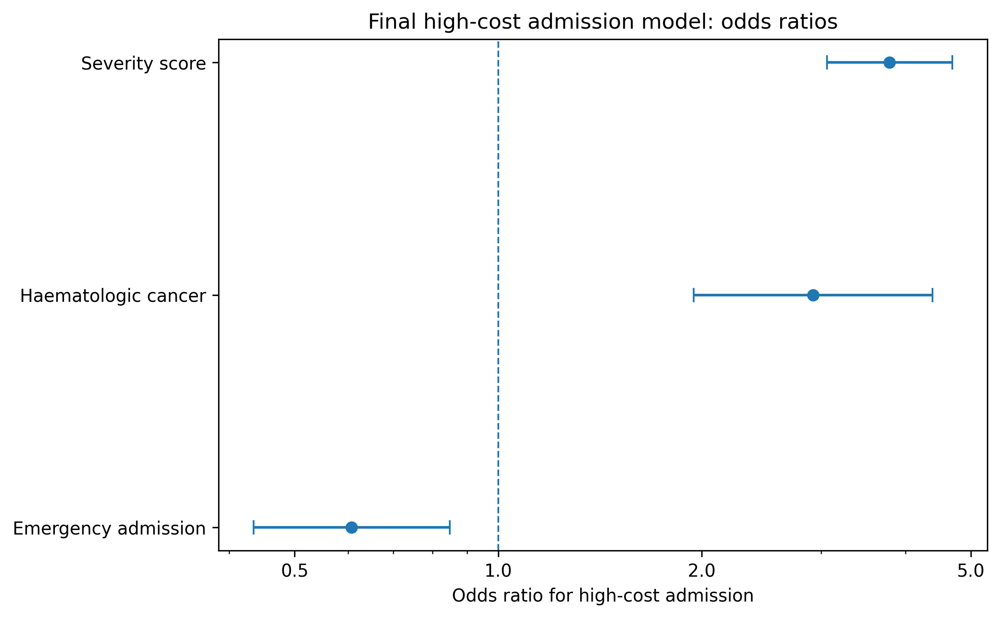
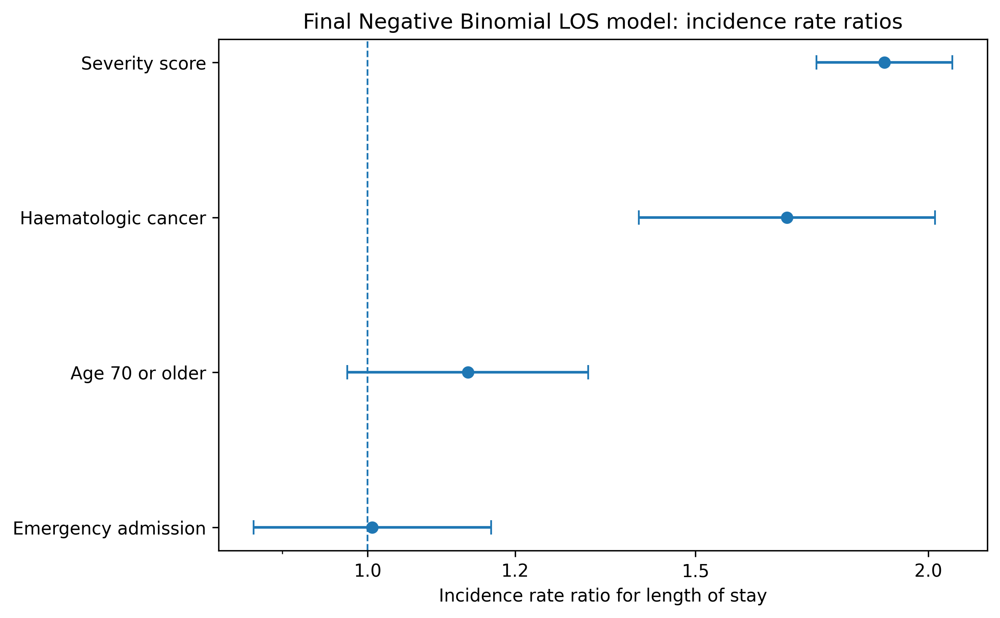

# Primary Cancer Inpatient Utilisation and Cost Variation Using SPARCS 2024 Administrative Discharge Data

A retrospective cost and utilisation analysis of primary cancer inpatient admissions using a cleaned SPARCS 2024 hospital discharge extract. The analysis examines inpatient cost, high-cost admission status and length of stay (LOS), with a focus on reproducible administrative-data workflow, oncology cohort construction, descriptive utilisation analysis and adjusted regression modelling.

[Full Word report](docs/oncology_sparcs_report.docx) | [Full PDF report](docs/oncology_sparcs_report.pdf)

---

## Report scope

| Item | Specification |
|---|---|
| Dataset | NY SPARCS 2024 hospital inpatient discharge extract; 50,000 cleaned admissions |
| Study population | Primary cancer inpatient admissions identified using CCSR diagnosis groupings; analysis cohort n=1,218 |
| Analysis type | Retrospective cost and utilisation analysis using administrative discharge data |
| Main outcomes | Total inpatient cost, high-cost admission status and length of stay; total charges retained as a descriptive financial measure |
| Reported models | Gamma GLM with log link for total costs; logistic GLM for high-cost admission status; Negative Binomial GLM for length of stay |
| Model checks | LOS model adequacy and cost prediction checks; sensitivity evidence retained in appendix |

---

## Executive summary

This report examines inpatient utilisation and cost variation among primary cancer admissions identified from a cleaned SPARCS 2024 hospital discharge extract. SPARCS is a New York State de-identified hospital discharge dataset containing discharge-level information on patient characteristics, diagnoses, procedures, services and charges.<sup>1</sup> The cleaned extract contained 50,000 inpatient records. The main analysis cohort comprised 1,218 admissions classified as primary cancer admissions using International Classification of Diseases, Tenth Revision, Clinical Modification (ICD-10-CM) and Clinical Classifications Software Refined (CCSR) diagnosis groupings.<sup>2</sup> Descriptive comparisons used the wider cleaned extract where relevant, while adjusted modelling was restricted to the primary cancer cohort.

Primary cancer admissions represented 2.44% of the cleaned extract. Median LOS was 4.0 days and mean LOS was 7.39 days. Median total inpatient cost was $27,049 and mean total inpatient cost was $41,849, indicating that cost was concentrated in a higher-cost upper tail. High-cost admission status was defined as admissions above the upper quartile of total inpatient cost, equivalent to $47,065, and included 25.0% of the primary cancer cohort. Emergency admission type accounted for 40.3% of admissions, adults aged 70 years or above accounted for 39.7%, and haematologic cancers accounted for 12.7%.

The reported adjusted analysis used three main models. A Gamma generalised linear model (GLM) with log link was used for total inpatient cost, a logistic GLM was used for high-cost admission status, and a Negative Binomial GLM was used for LOS. Model adequacy checks supported this structure and are retained as supporting evidence rather than as headline findings.<sup>8,9,11</sup>

Severity score and haematologic cancer were the most consistent markers of higher inpatient resource use. In the Gamma cost model, each one-level increase in severity score was associated with a cost ratio of 1.65, while haematologic cancer was associated with a cost ratio of 1.68. In the high-cost logistic model, severity score was associated with higher odds of high-cost admission, with an odds ratio (OR) of 3.79, while haematologic cancer was also associated with higher odds, with an OR of 2.92. In the Negative Binomial LOS model, severity score was associated with longer expected stay, with an incidence rate ratio (IRR) of 1.89, while haematologic cancer was associated with an IRR of 1.68.

The findings should be interpreted as adjusted associations from admission-level administrative data, not as causal estimates. The report does not compare alternative interventions, estimate an incremental cost-effectiveness ratio, or measure quality-adjusted life years (QALYs). It is a retrospective cost and utilisation analysis of inpatient oncology resource use. Its main use is to identify where cost and LOS are concentrated and to support severity-adjusted monitoring in hospital planning, financial review and data-quality improvement.<sup>3</sup>

---

## Research questions and analytical outputs

| Research question | Analytical output |
|---|---|
| RQ1. What is the inpatient cost and utilisation profile of primary cancer admissions? | Cohort profile, cost and LOS summaries, diagnosis group, severity, admission type and payer tables |
| RQ2. Which admission-level factors are associated with total inpatient cost? | Gamma GLM with log link for total inpatient cost |
| RQ3. Which admission-level factors are associated with high-cost admission status? | Logistic GLM for high-cost admission indicator |
| RQ4. Which admission-level factors are associated with length of stay? | Negative Binomial GLM for length of stay |
| RQ5. What do the findings imply for service planning and health economics interpretation? | Discussion, service planning implications and limitations |

---

## Methods overview

The unit of analysis was the hospital admission, not the individual patient. The study design was retrospective, observational and secondary-data based. No intervention was assigned and no causal contrast was estimated. The analysis therefore describes patterns and adjusted associations in inpatient resource use rather than estimating treatment effectiveness or clinical outcomes.

The raw extract contained 50,000 inpatient records and 33 columns. After cleaning and validation, the analysis dataset retained 50,000 rows and 49 cleaned or derived variables. Primary cancer admissions were identified using cleaned CCSR diagnosis descriptions and cancer-related classification flags. The primary cancer cohort contained 1,218 admissions, with 25 unique primary cancer CCSR codes in the data.

| Item | Value |
|---|---:|
| Raw SPARCS extract rows | 50,000 |
| Raw SPARCS extract columns | 33 |
| Cleaned analysis rows | 50,000 |
| Cleaned analysis columns | 49 |
| Primary cancer admissions | 1,218 |
| Broader cancer-related admissions | 1,377 |
| Model input rows | 1,218 |
| Unique primary cancer CCSR codes | 25 |
| Invalid LOS rows | 0 |
| Missing or invalid total charges rows | 0 |
| Missing or invalid total costs rows | 0 |

Source: `outputs/final_tables/01_notebook_02_validation_summary.csv`; `outputs/final_tables/02_notebook_02_cohort_size_assessment.csv`.

---

## Outcomes and covariates

The main economic outcome was total inpatient cost. Total charges were retained for descriptive comparison but were not treated as the main economic outcome. Length of stay was measured in inpatient days. High-cost admission status was derived using the 75th percentile of total inpatient cost, with admissions above $47,064.56 classified as high-cost. Long-stay status was derived using the 75th percentile of LOS, with admissions above 8 days classified as long-stay. The 75th percentile was used as an internal upper-quartile threshold to identify the higher-resource tail of this dataset, not as a clinical threshold or external benchmark.<sup>7</sup>

The adjusted models used a deliberately limited covariate set: APR severity score, emergency admission type, older adult aged 70 years or above, and haematologic cancer.

| Variable | Definition / role | Value in cohort |
|---|---|---:|
| Severity score | Ordinal APR severity score, Minor=1 to Extreme=4 | Mean 2.33 |
| Emergency admission | Emergency admission type indicator | 40.3% |
| Older adult 70+ | Age group 70 years or older | 39.7% |
| Haematologic cancer | Leukaemia, lymphoma or myeloma diagnosis group | 12.7% |

Source: `outputs/supporting_tables/notebook_05_covariate_summary.csv`; checked against `outputs/final_tables/14_notebook_05_model_dataset_summary.csv`.

---

## Results

### Primary cancer and non-cancer comparison

The primary cancer cohort contained 1,218 admissions, representing 2.44% of the cleaned 50,000-record inpatient extract. The non-cancer comparison group contained 48,259 admissions and should not be interpreted as the full complement of the primary cancer cohort, because the project classification also identified broader cancer-related-only records and excluded keyword-matched non-cancer records.

| Group | Admissions | Median LOS | Mean LOS | Median total cost | Median total charges | Emergency admission |
|---|---:|---:|---:|---:|---:|---:|
| Non-cancer | 48,259 | 3.0 | 5.71 | $13,885 | $46,535 | 66.7% |
| Primary cancer | 1,218 | 4.0 | 7.39 | $27,049 | $91,355 | 40.3% |

Source: `outputs/final_tables/04_notebook_03_primary_vs_non_cancer_summary.csv`.







### Overall primary cancer utilisation and cost summary

| Metric | Value |
|---|---:|
| Admissions | 1,218 |
| Median LOS | 4.0 days |
| Mean LOS | 7.39 days |
| 75th percentile LOS | 8.0 days |
| Median total charges | $91,355 |
| Mean total charges | $145,212 |
| Median total costs | $27,049 |
| Mean total costs | $41,849 |
| Median cost per inpatient day | $6,882 |
| Emergency department admissions | 37.8% |
| Emergency admission type | 40.3% |
| Long-stay admissions | 24.0% |
| High-cost admissions | 25.0% |

Source: `outputs/final_tables/06_notebook_04_overall_utilisation_cost_summary.csv`.

### Variation by severity

Severity showed the clearest descriptive gradient. Median total cost increased from $19,978 for minor severity admissions to $70,573 for extreme severity admissions. Median LOS increased from 1.0 day in the minor group to 14.0 days in the extreme group. The proportion of high-cost admissions also increased from 4.3% in the minor group to 66.4% in the extreme group.

| Severity | Admissions | Median LOS | Mean LOS | Median cost | Mean cost | High-cost | Long-stay |
|---|---:|---:|---:|---:|---:|---:|---:|
| Minor | 233 | 1.0 | 2.43 | $19,978 | $22,694 | 4.3% | 3.0% |
| Moderate | 464 | 3.0 | 4.86 | $25,621 | $30,732 | 14.2% | 11.6% |
| Major | 405 | 6.0 | 9.82 | $33,675 | $47,624 | 37.5% | 36.3% |
| Extreme | 116 | 14.0 | 18.99 | $70,573 | $104,635 | 66.4% | 72.4% |

Source: `outputs/supporting_tables/notebook_04_utilisation_cost_by_severity.csv`.





### Variation by diagnosis group

Diagnosis group variation was substantial. Respiratory cancers and colorectal cancers were the largest groups, accounting for 210 and 202 admissions respectively. Among diagnosis groups with at least 20 admissions, acute myeloid leukaemia had the highest median total cost ($76,435) and median LOS (18.0 days). Multiple myeloma also had high median cost ($55,323) and median LOS (11.0 days).





Source: `outputs/final_tables/07_notebook_04_utilisation_cost_by_diagnosis_group.csv`.

### Reported adjusted model effects

Adjusted model results are presented as ratios. A ratio above 1.00 indicates a higher expected outcome relative to the reference or per one-level increase in the predictor, while a ratio below 1.00 indicates a lower expected outcome. Cost ratios describe multiplicative differences in expected total inpatient cost. Odds ratios describe the odds of admission into the high-cost group. Incidence rate ratios describe multiplicative differences in expected LOS.

| Model | Term | Effect estimate with 95% CI | p-value |
|---|---|---:|---:|
| Gamma GLM, total inpatient cost | Severity score | 1.65 (1.56 to 1.75) | <0.001 |
| Gamma GLM, total inpatient cost | Emergency admission | 0.74 (0.66 to 0.83) | <0.001 |
| Gamma GLM, total inpatient cost | Age 70 or older | 0.88 (0.80 to 0.96) | 0.005 |
| Gamma GLM, total inpatient cost | Haematologic cancer | 1.68 (1.38 to 2.04) | <0.001 |
| Logistic GLM, high-cost admission | Severity score | 3.79 (3.06 to 4.69) | <0.001 |
| Logistic GLM, high-cost admission | Emergency admission | 0.61 (0.43 to 0.85) | 0.004 |
| Logistic GLM, high-cost admission | Haematologic cancer | 2.92 (1.94 to 4.39) | <0.001 |
| Negative Binomial GLM, length of stay | Severity score | 1.89 (1.74 to 2.06) | <0.001 |
| Negative Binomial GLM, length of stay | Emergency admission | 1.01 (0.87 to 1.16) | 0.939 |
| Negative Binomial GLM, length of stay | Age 70 or older | 1.13 (0.98 to 1.31) | 0.103 |
| Negative Binomial GLM, length of stay | Haematologic cancer | 1.68 (1.40 to 2.02) | <0.001 |

Sources: `outputs/final_tables/11_notebook_05_los_negative_binomial_model_results_report_facing.csv`; `outputs/final_tables/12_notebook_05_cost_gamma_model_results_report_facing.csv`; `outputs/final_tables/13_notebook_05_high_cost_logistic_model_results_report_facing.csv`.







---

## Discussion

The analysis shows that inpatient oncology resource use in the SPARCS 2024 extract was concentrated in a relatively small but high-resource cohort. Primary cancer admissions represented 2.44% of the cleaned extract, but had higher median LOS and higher median total cost than the non-cancer comparison group. The resource-use profile reflected not only admission count, but also greater cost intensity, longer stays and a distinct upper cost tail within the primary cancer cohort.

Severity was the most consistent finding. It showed a clear descriptive gradient across median cost, median LOS, long-stay percentage and high-cost percentage, and remained strongly associated with cost, high-cost status and LOS in adjusted models. For service planning, this means that crude counts of cancer admissions are insufficient. Monitoring should account for case mix and severity, otherwise comparisons across admission pathways or diagnosis groups may understate resource intensity.

Haematologic cancer was the second consistent signal. Although haematologic cancers represented 12.7% of the model cohort, they were associated with higher expected cost, higher odds of high-cost admission and longer LOS. The diagnosis-level results were aligned with this pattern: acute myeloid leukaemia and multiple myeloma had some of the highest median costs and longest median stays among groups with adequate sample size. This supports separate monitoring of haematologic malignancy admissions rather than treating oncology admissions as a homogeneous group.

Emergency admission type requires cautious interpretation. Descriptively, emergency admissions had longer median LOS than elective admissions. In the adjusted models, however, emergency admission was not associated with longer LOS and was associated with lower expected cost and lower odds of high-cost admission. This pattern suggests that emergency status should be considered alongside severity and diagnosis group rather than used as a standalone cost-risk marker.

---

## Service planning and analytics implications

- Oncology inpatient dashboards should include severity-adjusted cost and LOS measures, not only crude admission counts.
- Haematologic cancer admissions should be monitored as a distinct resource-use group.
- High-cost admissions should be monitored as a separate outcome rather than inferred from mean cost alone.
- Emergency admission should be interpreted with severity and diagnosis group.
- Data quality and coding transparency should be maintained through documented cohort definitions, derived variables and reproducible evidence exports.

The immediate value of this report is a reproducible evidence base for targeted service review rather than a policy mandate.<sup>12</sup>

---

## Limitations

The dataset describes inpatient discharges, not patient pathways, and cannot reliably distinguish one patient with multiple admissions from multiple patients with single admissions. The results therefore apply to admissions, not individual cancer patients.

The analysis used administrative diagnosis groupings rather than detailed oncology clinical information. Tumour stage, treatment intent, chemotherapy or radiotherapy details, disease progression, genomic markers, performance status and treatment line were not available in the report-facing dataset.

Cost was limited to inpatient cost fields in SPARCS. The analysis does not include outpatient oncology costs, physician professional fees outside the inpatient record, patient out-of-pocket costs, caregiver time, travel cost, productivity loss, post-discharge costs or end-of-life community care costs.

Adjusted model results are associations, not causal effects. Emergency admission, age group, severity and haematologic cancer may be associated with unmeasured clinical and operational factors. Residual confounding is likely because administrative discharge data cannot fully capture clinical complexity.

This report is not a full economic evaluation. It does not compare alternative interventions, estimate incremental cost-effectiveness ratios, measure QALYs or assess cost-effectiveness.<sup>3</sup>

The extract contains 50,000 inpatient records rather than the full SPARCS population. The results should therefore be treated as an analysis of the selected extract, not as a complete New York State oncology hospitalisation estimate.

---

## Model adequacy and sensitivity checks

Model adequacy checks are reported as supporting evidence rather than as final findings. The reported LOS findings are based on the Negative Binomial model; the Poisson specification was used only as a diagnostic benchmark. The benchmark produced a Pearson dispersion ratio of 10.22, indicating overdispersion and supporting the Negative Binomial LOS model.

The cost prediction check showed that the Gamma model captured central tendency more closely than the upper cost tail: predicted median total cost was $28,101 compared with the observed median of $27,049, while predicted mean total cost was $30,534 compared with the observed mean of $41,849.

| Diagnostic / check | Result | Interpretation |
|---|---|---|
| LOS overdispersion diagnostic | Pearson dispersion ratio 10.22 | Supports use of the Negative Binomial model for reported LOS findings; Poisson output is not used as a final finding |
| Observed vs predicted median cost | $27,049 vs $28,101 | Predicted median close to observed median |
| Observed vs predicted mean cost | $41,849 vs $30,534 | Upper cost tail not fully reproduced by the continuous cost model |
| Log-linear OLS cost model | Directionally consistent with Gamma cost model | Retained as sensitivity evidence, not as the primary cost result |

Sources: `outputs/final_tables/15_notebook_05_los_model_diagnostics.csv`; `outputs/final_tables/16_notebook_05_cost_model_prediction_summary.csv`.

---

## Reproducibility

The analysis was organised into raw data, processed datasets, modelling notebooks, final tables, final figures and report assets. The public repository intentionally excludes row-level raw and processed datasets. It retains the notebooks, aggregate evidence tables, figures and full report needed to review the workflow and findings.

### Repository structure

```text
project-01-sparcs-oncology-cost-analysis/
├── README.md
├── requirements.txt
├── .gitignore
├── data/
│   └── README.md
├── docs/
│   ├── oncology_sparcs_report.docx
│   └── oncology_sparcs_report.pdf
├── notebooks/
│   ├── 02_data_cleaning_validation_50000_ready_fixed.ipynb
│   ├── 03_cancer_cohort_profile_descriptive_analysis.ipynb
│   ├── 04_utilisation_and_cost_analysis_final_thresholds.ipynb
│   ├── 05_modelling_workflow_final_report_ready_clean_ticks.ipynb
│   └── 06_final_evidence_pack_export_fixed.ipynb
├── outputs/
│   ├── final_tables/
│   ├── supporting_tables/
│   ├── final_figures/
│   └── report_assets/
└── src/
    ├── config.py
    ├── cohort_definitions.py
    ├── model_interpretation.py
    └── reporting_helpers.py
```

### Run order

```bash
python -m venv .venv
source .venv/bin/activate
pip install -r requirements.txt
jupyter notebook
```

Run notebooks in this order if reproducing locally with the source data available:

1. `02_data_cleaning_validation_50000_ready_fixed.ipynb`
2. `03_cancer_cohort_profile_descriptive_analysis.ipynb`
3. `04_utilisation_and_cost_analysis_final_thresholds.ipynb`
4. `05_modelling_workflow_final_report_ready_clean_ticks.ipynb`
5. `06_final_evidence_pack_export_fixed.ipynb`

---

## References

1. New York State Department of Health. Hospital Inpatient Discharges (SPARCS De-Identified): 2024. Health Data NY. Accessed 18 May 2026.
2. Agency for Healthcare Research and Quality. Clinical Classifications Software Refined (CCSR) for ICD-10-CM Diagnoses, v2024.1. Healthcare Cost and Utilization Project. Rockville, MD: AHRQ; 2023.
3. Drummond MF, Sculpher MJ, Claxton K, Stoddart GL, Torrance WG. *Methods for the Economic Evaluation of Health Care Programmes*. 4th ed. Oxford: Oxford University Press; 2015.
4. Guinness L, Wiseman V, editors. *Introduction to Health Economics*. 2nd ed. Maidenhead: Open University Press; 2011.
5. Bowling A. *Research Methods in Health: Investigating Health and Health Services*. 5th ed. Maidenhead: Open University Press; 2023.
6. Krentel A, McKee M, editors. *Issues in Public Health: Challenges for the 21st Century*. 3rd ed. Maidenhead: Open University Press; 2022.
7. Kirkwood BR, Sterne JAC. *Essentials of Medical Statistics*. 2nd ed. Malden, MA: Blackwell Science; 2003.
8. Deb P, Norton EC, Manning WG. *Health Econometrics Using Stata*. College Station, TX: Stata Press; 2017.
9. Manning WG, Mullahy J. Estimating log models: to transform or not to transform? *Journal of Health Economics*. 2001;20(4):461-494.
10. Fox J. *Applied Regression Analysis and Generalized Linear Models*. 3rd ed. Thousand Oaks, CA: SAGE; 2016.
11. Cameron AC, Trivedi PK. *Regression Analysis of Count Data*. 2nd ed. Cambridge: Cambridge University Press; 2013.
12. Buse K, Mays N, Walt G. *Making Health Policy*. 2nd ed. Maidenhead: Open University Press; 2012.
